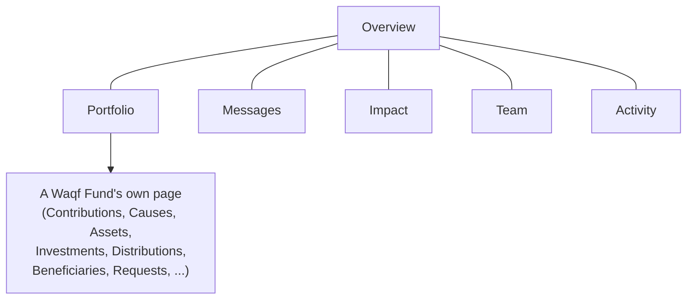

# The Founder Dashboard

Once a Founder finishes [establishment](./waqf-funds) (sign-up,
verification, Foundation, first Waqf Fund, deed), they land on the
Founder Portal's dashboard — a sidebar of six screens, plus an Account
& security page reached from the sidebar footer. This page walks
through each one.

Every screen here follows the Founder Portal's standing design rule:
**view and request, never govern.** Anything that actually moves money
or changes a Waqf Fund's governance — asset disposal, distribution
approval, investment changes, beneficiary-criteria changes — happens on
Birr's own side, through the `governed_actions` maker-checker engine
described in [Governance](./governance). Nothing in this dashboard can
approve or execute one of those actions; several screens let a Founder
*ask* for one.

## Overview

The landing page — a summary, not a working list. It leads with one
honest headline number (how many waqfs Birr holds in trust for this
Founder, across however many Foundations), then a row of stat cards
split by **type and currency** rather than blended into one figure:
declared corpus, amount raised, and amount distributed. This is
deliberate, not an oversight — a Project waqf's corpus and an
Investment waqf's corpus carry different fiduciary character, and
mixing them (or mixing currencies) would hide that. A donut chart
breaks funds down by status when there's more than one. Below that, a
compact list of each Foundation with a link into the full
[Portfolio](#portfolio) and a shortcut to add another Waqf Fund. A
Founder with no waqf yet sees a welcoming empty state instead of a
literal "0," with a single call to action: establish a Foundation.

## Portfolio

The actual Foundation → Waqf Fund breakdown, searchable by fund name,
Foundation name, or type. Each fund is a card grouped under its
Foundation; clicking one opens that **Waqf Fund's own page**, which is
where most of the dashboard's real depth lives. That detail page
assembles up to eleven sections depending on the fund's type and stage
— all read-only except where noted:

| Section | What it shows | Founder can act? |
|---|---|---|
| **Lifecycle** *(Project only)* | The 13 waqf lifecycle stages from CLAUDE.md, computed live, never persisted | No |
| **Project Progress** *(Project only)* | Milestones with full budget-vs-actual and evidence — a Founder gets the complete picture here, unlike a Vault's anonymous public page | No |
| **Contributions** | Funding progress against the declared corpus target, plus contribution history | **Yes** — top up the fund via card, Paystack, or stablecoin |
| **Causes** | The standard cause catalog; which ones this fund supports, and how much corpus (and, for Investment funds, proceeds) is allocated to each | **Yes** — select/unselect causes and set allocation amounts, entirely self-service (see [Waqf Funds](./waqf-funds#causes--organizing-a-waqf-funds-purpose)) |
| **Assets** | Every registered asset backing this fund | No — registration and disposal are Birr-staff-mediated |
| **Investments** *(Investment only)* | Portfolio holdings and their Shariah-review status | No |
| **Proceeds** *(Investment only)* | Investment returns Birr staff have recorded | No |
| **Distributions** | Payout history, aggregated **by cause** — never individual distribution rows | No |
| **Beneficiaries** | An aggregate count and criteria summary — never individual names | **Yes** — nominate a beneficiary (individually or in bulk) for staff review |
| **Requests** | The Founder Portal's structured "ask" queue — see [below](#requests-the-portals-request-half) | **Yes** — submit a request |
| **Governance Activity** | Decided (approved/rejected) governed actions on this fund — nothing still pending shows here | No |
| **Financial Report** | Generated on demand, exportable to PDF; every generation writes its own audit-log entry | **Yes** — generate a report |

Two confidentiality rules run through this whole page: **Beneficiaries
are always an aggregate**, never a name or individual eligibility
detail, matching standard endowment donor-confidentiality practice; and
**Governance Activity only shows decided actions**, since a still-open
proposal could still be rejected and isn't yet something real to report
back.

### Requests — the Portal's "request" half {#requests-the-portals-request-half}

A Founder asking for a distribution approval, investment change,
beneficiary-criteria change, or asset disposal used to have no
structured way to do it beyond free-text messages. Submitting a request
here **never writes directly to `governed_actions`** — it's its own
separate record. A Birr staff member reviews it and, if they agree,
creates the real governed action themselves through the normal Ops
Console flow, with a human maker and a different human checker exactly
as every other governed action requires. Requests are named by Cause,
not by an individual Beneficiary, for the same confidentiality reason
noted above.

## Messages

An inbox of every Foundation this Founder belongs to that has at least
one message thread with Birr, most recently active first. For a
Founder with a single Foundation this is a one-row list; for someone
who co-founded more than one, it's the only place to see every
conversation without visiting each Foundation's page individually.
Unread threads carry an indicator dot, matching the unread badge shown
next to "Messages" in the sidebar itself. Clicking a thread opens that
Foundation's own page, where the actual conversation lives.

## Impact

Every periodic impact update Birr staff have logged, across **every**
cause on **every** Waqf Fund this Founder owns — one place to see what
has actually been achieved, rather than having to check each fund
separately. Each entry shows the fund, the cause, the reporting period,
a narrative, and (when supplied) a reported metric value. Searchable by
fund, cause, period, or narrative text. This is purely a report-back
screen — nothing here is editable by a Founder.

## Team

Who has access to this Foundation's account. Three permission levels:

- **Viewer** — can see the portfolio, nothing more.
- **Requester** — can also suggest and select/unselect causes.
- **Primary contact** — full access, including inviting or revoking
  other members.

Any active member can view this page, but only the primary contact
sees the invite/revoke controls — everyone else would simply get
rejected by the backend, so the UI just doesn't show what they can't
use. Inviting someone sends an email with a signed acceptance link;
if automated email delivery fails, the link is shown directly so it can
be shared manually (the screenshot in this conversation is exactly that
fallback state). Pending invitations are listed separately from active
members, each with its own expiry and a revoke action.

## Activity

This Founder's own team's history across every Foundation and Waqf
Fund they touch — allocation changes, cause selection, deed signings,
invitations, and more — newest first, with pagination. This is
distinct from a fund's **Governance Activity** section: that one shows
*Birr staff's* decisions on one specific fund, while this page shows
*the Founder's own team's* actions, account-wide. It's a direct,
paginated read of `audit_logs`, scoped to this Founder, with before/after
snapshots deliberately left out of the response — this page reports
*that* an action happened, not its internal payload.

## Account & security

Reached via the Founder's name at the bottom of the sidebar, not a main
nav item. Two things live here:

- **Two-factor authentication** — opt-in (unlike Birr staff, for whom
  MFA is mandatory at sign-in). Enabling it walks through a QR-code
  scan, a 6-digit confirmation, and a one-time display of backup codes.
  Losing both a device and its backup codes requires a platform admin
  to reset it.
- **Notification preferences** — four categories (governance & waqf
  status, money movement, team & causes, messages), each independently
  toggled for email and WhatsApp delivery. Everything always appears in
  the in-app notification bell regardless of these settings; WhatsApp
  delivery additionally requires a verified WhatsApp number, set up
  during onboarding.
