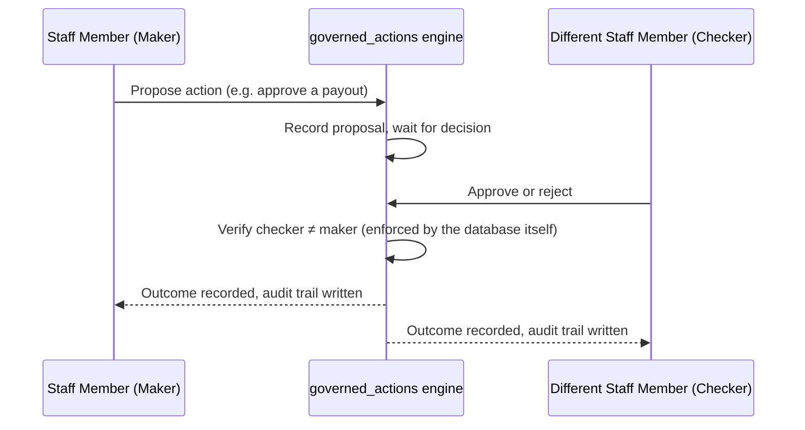

# The Governance Model — Shared by Both Products

## The maker-checker rule

Every sensitive, money-moving, or trust-affecting decision — asset
disposal, distribution approval, investment changes,
beneficiary-criteria changes, and every [Vault](./vaults) governance
action — requires two different people: one proposes the action, and a
**different** person must approve it before it takes effect. Neither
the same person, nor a single actor role, can complete both halves of
the decision.

This isn't only an application rule that a bug or a shortcut could
bypass — the database itself refuses to record a decision where the
approver and the proposer are the same person, as a hard constraint
independent of the application code.

## Segregation of duties among Birr's staff

Birr's own staff are organized into distinct functional roles, not a
flat "admin" account:

| Role | Function |
|---|---|
| **Mutawalli Officer** | Case-carrying trustee officer; typically proposes governed actions |
| **Board of Trustees** | Apex governance body; final sign-off on the most consequential decisions |
| **Shariah Supervisory Board** | Shariah compliance oversight |
| **Investment Committee** | Reviews and decides investment/portfolio matters |
| **Audit Committee** | Independent review of governed actions and financial controls |
| **Risk & Compliance Officer** | Regulatory and risk compliance review |
| **Legal Adviser** | Legal review of deeds and legally consequential decisions |
| **External Auditor** | Independent third-party assurance — read-only by design, never a proposer or approver, to preserve independence |

No one role can both single-handedly propose and approve the same class
of decision — the pairing of who may propose vs. who may approve a
given action is itself deliberately split across different roles.

## The immutable audit trail

Every creation, update, or deletion touching a governed record — a
Founder, a Waqf Fund, an Asset, a Beneficiary, a Distribution, an
Investment, a Vault, or a Vault Contribution — writes a permanent,
append-only record: who acted, what kind of actor they were, when, and
a full before/after snapshot of what changed. Nothing governed is ever
hard-deleted; a record can be marked inactive, but the history is never
erased. The database itself is configured so that even Birr's own
running application cannot update or delete an existing audit record —
only ever add a new one.

## AI assistance — advisory only, structurally enforced

Birr uses AI agents to help its staff work more efficiently, never to
replace their judgment or bypass governance. Every fiduciary agent can
only ever **propose** a governed action — draft a document, flag an
anomaly, suggest a value — exactly the same "maker" role a human staff
member can hold. None of them can ever **approve** one.

This isn't a setting anyone could accidentally misconfigure: there is
no field in Birr's data model for an AI agent to occupy the "approver"
role at all. It doesn't exist to be turned on.

| Agent | Role |
|---|---|
| **Rasid** ("the observer") | Watches regulatory change per waqf, drafts compliance impact summaries |
| **Nazim** ("the organizer") | Surfaces what needs a staff member's attention today |
| **Kashif** ("the revealer") | Flags unusual patterns in governance decisions for review |
| **Rashid** ("the wise") | Shariah-compliance screening and portfolio drift monitoring for the Investment Committee |
| **Rafiq** ("the companion") | Guides a Founder through self-service establishment, drafting content for the Founder's own review |
| **Munsif** ("the fair one") | Checks beneficiary eligibility and drafts distribution recommendations |
| **Bashir** ("the herald") | Drafts marketing content — always reviewed by a human before anything publishes |

A separate, non-fiduciary agent (Bashir) drafts marketing content only;
it never touches governed decisions at all.
