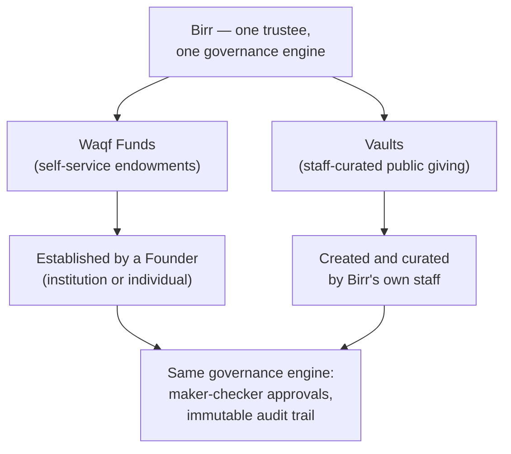

# What Birr Is

Birr is a **digital trustee for Islamic waqf** — an endowment structure
under Islamic law in which a person or institution permanently sets
aside money, property, or another asset for a charitable purpose. Once
established, a waqf is not meant to be spent down or reclaimed; it's
managed, indefinitely, for the benefit its founder intended.

Managing a waqf responsibly has traditionally required a trusted party —
a **Mutawalli** — to hold and administer it on the founder's behalf,
under religious and legal obligation to act faithfully. Birr's entire
purpose is to be that trustee, digitally: Birr is appointed Mutawalli
for every waqf established through it, and from that point forward
carries the ongoing legal and religious responsibility of managing it
well.

That trustee relationship attaches at **establishment**, not before.
Nothing is held in trust until a founder actually creates a waqf on the
platform; the moment they do, Birr's fiduciary duty begins.

Because Birr is acting as a trustee over other people's endowed assets —
not merely operating software — this is treated throughout as a
**fiduciary system**: correctness, auditability, and access control are
prioritized ahead of feature velocity everywhere in how it's built.

## Two products, one trustee

Birr runs two genuinely separate products under that one trustee role:

- **Waqf Funds** — a Founder (an institution or an individual) sets up
  their own endowment, self-service, and Birr becomes trustee over it.
  This is the classical waqf model, digitized. See [Waqf Funds](./waqf-funds).
- **Vaults** — Birr's own staff curate public giving campaigns (for
  example, "Ramadan Relief Vault") that anyone can donate to directly,
  with no need to become a Founder or establish anything themselves. See
  [Vaults](./vaults).

Both run through the identical governance engine underneath — the same
maker-checker approval system, the same immutable audit trail, the same
standard catalog of causes — but they serve different people and start
in different ways. See [Governance](./governance) for the engine both
share.

## Who Birr Serves

- **Institutional Founders** — Islamic banks, universities, corporate
  foundations, NGOs, family offices, governments, and official awqaf
  (endowment) authorities that want to establish and operate their own
  endowment under professional, accountable trusteeship.
- **Individual Founders** — a single person can establish their own
  endowment directly, with the same self-service process as an
  institution.
- **The general public** — anyone can give to a Birr-curated Vault, with
  no account, no application, and no relationship with Birr beyond the
  gift itself.
