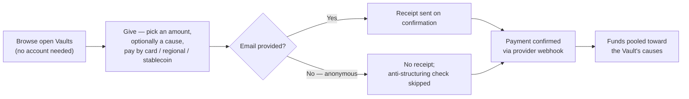

# Product Two: Vaults

## What a Vault is

A **Vault** is a public giving campaign — for example, "Ramadan Relief
Vault" — that Birr's own staff create and curate, tied to one or more
causes. Anyone can give to an open Vault directly. There is no Founder
involved in a Vault at any point: no Foundation, no deed, and no
account of any kind. A Vault donor never becomes a Founder, and a
Founder's Waqf Fund is never a Vault.

Vault exists to serve a different need than a Waqf Fund does: a Waqf
Fund is one Founder's own endowment, built for that Founder's specific
purpose; a Vault is a pooled, public campaign anyone can contribute to,
the way a platform-run fundraiser works — but administered under the
exact same fiduciary standards as everything else Birr holds.

|  | Waqf Fund | Vault |
|---|---|---|
| Who creates it | The Founder, self-service | Birr's own staff only |
| Who gives to it | The Founder (and anyone they invite) | The general public, by name or anonymously |
| Getting started | Self-service, no approval gate | Publishing a Vault is itself a governed, maker-checker-approved decision |
| Who receives payouts | Individually vetted, named Beneficiaries | Vetted delivery/relief-partner organizations (Counterparties) |

Vault deliberately reuses the same underlying infrastructure the
[Waqf Fund](./waqf-funds) product already has — the same three payment
rails, the same standard Cause catalog, the same partner-organization
registry, and the same maker-checker governance engine — rather than
duplicating any of it. What's new is a public-facing surface on top:
anyone can browse open Vaults and give, with no session, no account,
and no prior relationship with Birr.

## The two types of Vault

Vault has two types, mirroring the "corpus vs. direct spend" distinction
Waqf Funds make with three:

| Type | How pooled gifts are used |
|---|---|
| **Investment-style** | Pooled gifts are placed with a vetted partner organization; the return funds the Vault's causes, and the pooled corpus itself is preserved (the same perpetuity principle as an Investment Waqf Fund) |
| **Project-style** | Pooled gifts go directly to the Vault's causes — relief, education, or whatever the campaign was created for |

There is no Vault equivalent of an Asset Waqf Fund: a Vault is always
pooled, fungible cash, never a registered individual asset.

## How giving works

1. **Browse** — anyone can see every open Vault and the causes it
   supports, with no account required.
2. **Give** — pick an amount, optionally earmark a specific cause within
   the Vault, and pay by card, a regional payment rail, or stablecoin.
   Providing an email is optional, not required: giving anonymously is
   allowed, at the cost of two things — no receipt can be sent, and
   Birr's anti-structuring check (below) has no way to catch someone
   splitting one large gift into several small anonymous ones.
3. **Confirm** — the payment provider confirms completion via the same
   webhook-based mechanism a Waqf Fund contribution already uses.

## Governance and compliance controls

A Vault's own money-moving decisions run through the identical
maker-checker engine described in [Governance](./governance), via
**six governed actions**:

1. **Publishing** a draft Vault — the moment it starts publicly
   soliciting money at all.
2. **Allocating** pooled contributions to a specific cause.
3. **Allocating** recorded investment proceeds to a cause
   (investment-style Vaults only).
4. **Changing** an investment's allocation (investment-style Vaults
   only).
5. **Approving** a payout to a delivery/relief partner.
6. **Refunding** a confirmed gift — reversing a payment when something's
   wrong with it, through an auditable in-platform decision rather than
   staff fixing it by hand on a payment provider's own dashboard.

Two additional compliance controls apply specifically to public giving:

- **An identity threshold, set per currency.** A single gift at or above
  the threshold — or a donor's running total across several gifts
  crossing it — requires their name and a form of identification before
  the gift can complete. This is an anti-structuring safeguard: it
  catches someone trying to avoid identity checks by splitting one large
  gift into several smaller ones. Stablecoin gifts carry a materially
  lower threshold than card or bank gifts, since a completed crypto
  payment is far harder to reverse than a card charge.
- **A hold.** A compliance-tier staff member can flag any confirmed gift
  for review at any time, independent of whether it's ultimately
  refunded — this pauses nothing about the payment itself, just marks it
  for attention.
