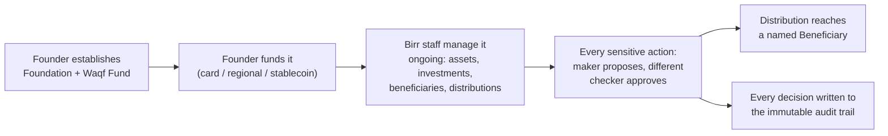

# Product One: Waqf Funds

## Establishment — self-service, no approval gate

A Founder can, entirely on their own, without any Birr staff
involvement or approval step:

1. **Sign up and verify** their identity (email and WhatsApp
   verification) before establishing anything.
2. **Establish a Foundation** — the organizational umbrella under which
   they'll operate one or more endowments.
3. **Establish one or more Waqf Funds** under that Foundation. Creating
   a Waqf Fund *is itself* the Founder's agreement that Birr becomes
   Mutawalli over it — there's no separate sign-off step.
4. **Fund it** — accept contributions through card payments (Stripe),
   regional payment rails (Paystack), or stablecoin.
5. **Generate a waqf deed** — the founding legal document, drafted from
   jurisdiction-specific templates. One deed, signed once, covers a
   Foundation and every Waqf Fund established under it, present and
   future.
6. **View** their own Foundations, Waqf Funds, and contributions at any
   time. Founder-facing tools are deliberately kept lightweight — view
   and request, never governance — because everything that happens
   after establishment is Birr's fiduciary responsibility, not the
   Founder's to operate.

## The three types of Waqf Fund

A Founder chooses one of three types when establishing a Waqf Fund,
depending on what they're endowing and how they want it to work:

| Type | What's endowed | How the cause is funded | Example |
|---|---|---|---|
| **Investment** | Liquid capital | The capital is invested in a Shariah-compliant portfolio; only the *returns* fund the cause — the principal is preserved indefinitely (the classical waqf principle of perpetuity) | A family endows $50,000 into a diversified halal portfolio; yearly returns fund scholarships indefinitely |
| **Asset** | A physical, income-producing property | The property itself, or the income it produces (rent, usage fees), funds the cause directly — there's no investment layer | A donated apartment building whose rental income pays a mosque's utilities and imam's stipend |
| **Project** | Funds committed to a specific initiative | Contributions fund the initiative directly, start to finish. This is the one type more than one Founder can establish jointly | Several institutions jointly fund a well-drilling program across rural villages |

A Founder can establish as many Waqf Funds, of any mix of types, under
one Foundation as they like.

## What happens after establishment — the trustee work

From the moment a Waqf Fund exists, everything that touches it runs
through Birr's own staff, using Birr's internal tools — never the
Founder:

- **Asset management**, including the decision to dispose of an asset.
- **Investment management**, for Investment-type Waqf Funds — placing
  capital, recording returns, and changing allocations.
- **Beneficiary administration** — identifying and managing who the
  Waqf Fund actually helps.
- **Distribution management** — approving and executing payouts to
  beneficiaries.
- **Compliance monitoring** — against the regulatory framework of the
  Waqf Fund's own jurisdiction (not the Founder's home jurisdiction,
  which may differ).
- **Audit trail and reporting** — a permanent, tamper-evident record of
  every governance decision, available for the Founder's own reporting
  at any time.
- **Conflict-of-interest management** — Birr staff declare conflicts of
  interest as structured, reviewable data, not free text.

See [Governance](./governance) for how the maker-checker approval step
actually works, and who at Birr is eligible to propose or approve each
kind of decision.

## Causes — organizing a Waqf Fund's purpose

A **Cause** is a theme or purpose bucket within one Waqf Fund — for
example, an "Education Waqf" might be split into "Scholarships" and
"School Supplies" causes. Every Beneficiary and every Distribution is
tracked against a specific Cause, so money is always attributable to a
defined purpose rather than one undifferentiated pool.

Causes are drawn from a **standard catalog** Birr's own team curates —
the same catalog [Vaults](./vaults) draw from. A Founder can search and
select from that catalog, or propose a new entry for Birr's team to
review and add. Founders also get read-only visibility into their own
Waqf Fund's Assets, Investments, Distributions (by cause), aggregate
Beneficiary counts (never individual identities — this matches standard
endowment donor-confidentiality practice), and any governance decisions
Birr staff have taken.
