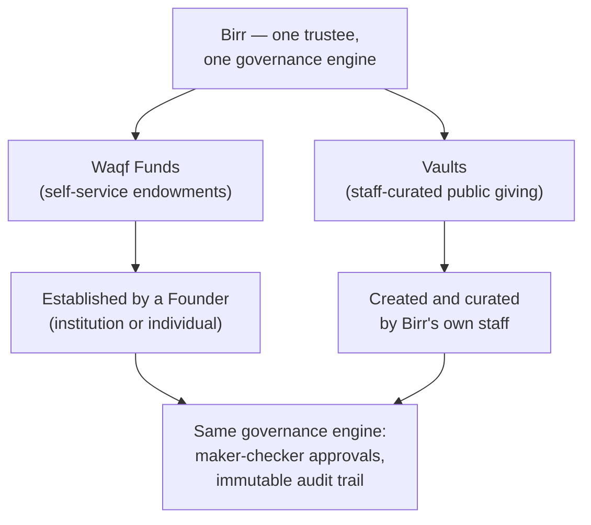
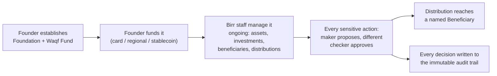
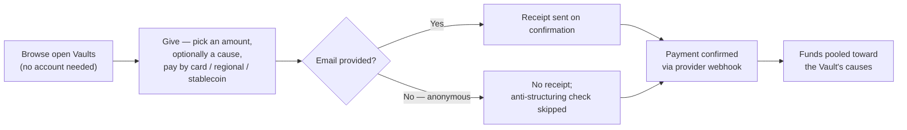
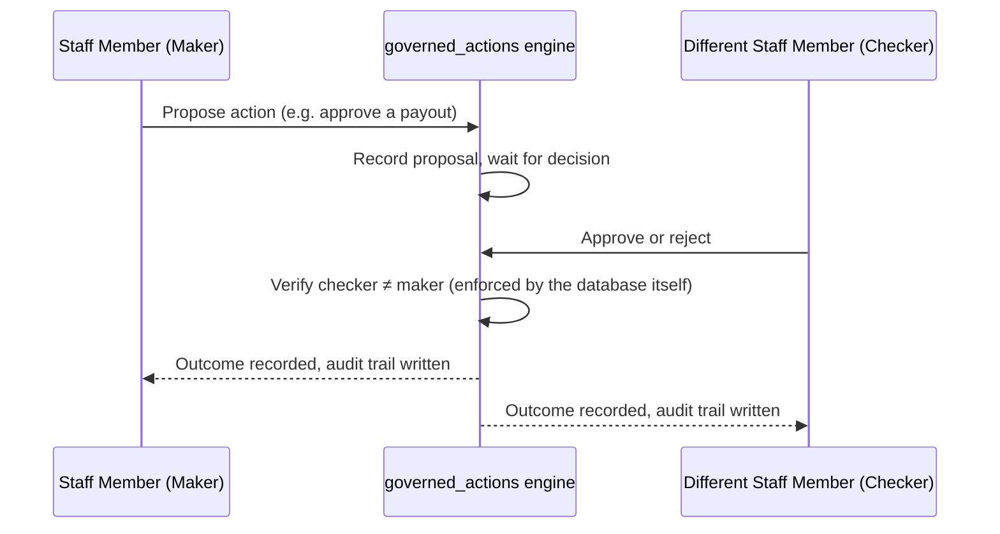

# Birr — Core Service

This document explains Birr as a product: what it is, who it serves,
what it does at each stage, and how its two products relate to each
other. It's written to stand on its own for a third-party reader —
a partner, an auditor, a new team member, a prospective Founder or
donor — with no assumed access to the codebase or prior context.

For the internal engineering operating model (non-negotiables, tech
stack, the AI agent roster, and the dated history of product decisions),
see `CLAUDE.md` in the repository root. This file is the product-level
counterpart to it, kept in sync with what's actually built rather than
what's planned.

---

## 1. What Birr Is

Birr is a **digital trustee for Islamic waqf** — an endowment structure
under Islamic law in which a person or institution permanently sets
aside money, property, or another asset for a charitable purpose. Once
established, a waqf is not meant to be spent down or reclaimed; it's
managed, indefinitely, for the benefit its founder intended.

Managing a waqf responsibly has traditionally required a trusted party —
a **Mutawalli** — to hold and administer it on the founder's behalf,
under religious and legal obligation to act faithfully. Birr's entire
purpose is to be that trustee, digitally: Birr is appointed Mutawalli
for every waqf established through it, and from that point forward
carries the ongoing legal and religious responsibility of managing it
well.

That trustee relationship attaches at **establishment**, not before.
Nothing is held in trust until a founder actually creates a waqf on the
platform; the moment they do, Birr's fiduciary duty begins.

Because Birr is acting as a trustee over other people's endowed assets —
not merely operating software — this is treated throughout as a
**fiduciary system**: correctness, auditability, and access control are
prioritized ahead of feature velocity everywhere in how it's built.

### Two products, one trustee

Birr runs two genuinely separate products under that one trustee role:

- **Waqf Funds** — a Founder (an institution or an individual) sets up
  their own endowment, self-service, and Birr becomes trustee over it.
  This is the classical waqf model, digitized.
- **Vaults** — Birr's own staff curate public giving campaigns (for
  example, "Ramadan Relief Vault") that anyone can donate to directly,
  with no need to become a Founder or establish anything themselves.

Both run through the identical governance engine underneath — the same
maker-checker approval system, the same immutable audit trail, the same
standard catalog of causes — but they serve different people and start
in different ways. Sections 3 and 4 below cover each in full; Section 5
covers the governance engine both share.

---

## 2. Who Birr Serves

- **Institutional Founders** — Islamic banks, universities, corporate
  foundations, NGOs, family offices, governments, and official awqaf
  (endowment) authorities that want to establish and operate their own
  endowment under professional, accountable trusteeship.
- **Individual Founders** — a single person can establish their own
  endowment directly, with the same self-service process as an
  institution.
- **The general public** — anyone can give to a Birr-curated Vault, with
  no account, no application, and no relationship with Birr beyond the
  gift itself.

---

## 3. Product One: Waqf Funds

### 3.1 Establishment — self-service, no approval gate

A Founder can, entirely on their own, without any Birr staff
involvement or approval step:

1. **Sign up and verify** their identity (email and WhatsApp
   verification) before establishing anything.
2. **Establish a Foundation** — the organizational umbrella under which
   they'll operate one or more endowments.
3. **Establish one or more Waqf Funds** under that Foundation. Creating
   a Waqf Fund *is itself* the Founder's agreement that Birr becomes
   Mutawalli over it — there's no separate sign-off step.
4. **Fund it** — accept contributions through card payments (Stripe),
   regional payment rails (Paystack), or stablecoin.
5. **Generate a waqf deed** — the founding legal document, drafted from
   jurisdiction-specific templates. One deed, signed once, covers a
   Foundation and every Waqf Fund established under it, present and
   future.
6. **View** their own Foundations, Waqf Funds, and contributions at any
   time. Founder-facing tools are deliberately kept lightweight — view
   and request, never governance — because everything that happens
   after establishment is Birr's fiduciary responsibility, not the
   Founder's to operate.

### 3.2 The three types of Waqf Fund

A Founder chooses one of three types when establishing a Waqf Fund,
depending on what they're endowing and how they want it to work:

| Type | What's endowed | How the cause is funded | Example |
|---|---|---|---|
| **Investment** | Liquid capital | The capital is invested in a Shariah-compliant portfolio; only the *returns* fund the cause — the principal is preserved indefinitely (the classical waqf principle of perpetuity) | A family endows $50,000 into a diversified halal portfolio; yearly returns fund scholarships indefinitely |
| **Asset** | A physical, income-producing property | The property itself, or the income it produces (rent, usage fees), funds the cause directly — there's no investment layer | A donated apartment building whose rental income pays a mosque's utilities and imam's stipend |
| **Project** | Funds committed to a specific initiative | Contributions fund the initiative directly, start to finish. This is the one type more than one Founder can establish jointly | Several institutions jointly fund a well-drilling program across rural villages |

A Founder can establish as many Waqf Funds, of any mix of types, under
one Foundation as they like.

### 3.3 What happens after establishment — the trustee work

From the moment a Waqf Fund exists, everything that touches it runs
through Birr's own staff, using Birr's internal tools — never the
Founder:

- **Asset management**, including the decision to dispose of an asset.
- **Investment management**, for Investment-type Waqf Funds — placing
  capital, recording returns, and changing allocations.
- **Beneficiary administration** — identifying and managing who the
  Waqf Fund actually helps.
- **Distribution management** — approving and executing payouts to
  beneficiaries.
- **Compliance monitoring** — against the regulatory framework of the
  Waqf Fund's own jurisdiction (not the Founder's home jurisdiction,
  which may differ).
- **Audit trail and reporting** — a permanent, tamper-evident record of
  every governance decision, available for the Founder's own reporting
  at any time.
- **Conflict-of-interest management** — Birr staff declare conflicts of
  interest as structured, reviewable data, not free text.

### 3.4 Causes — organizing a Waqf Fund's purpose

A **Cause** is a theme or purpose bucket within one Waqf Fund — for
example, an "Education Waqf" might be split into "Scholarships" and
"School Supplies" causes. Every Beneficiary and every Distribution is
tracked against a specific Cause, so money is always attributable to a
defined purpose rather than one undifferentiated pool.

Causes are drawn from a **standard catalog** Birr's own team curates
(the same catalog Vaults draw from — see Section 6). A Founder can
search and select from that catalog, or propose a new entry for Birr's
team to review and add. Founders also get read-only visibility into
their own Waqf Fund's Assets, Investments, Distributions (by cause),
aggregate Beneficiary counts (never individual identities — this
matches standard endowment donor-confidentiality practice), and any
governance decisions Birr staff have taken.

---

## 4. Product Two: Vaults

### 4.1 What a Vault is

A **Vault** is a public giving campaign — for example, "Ramadan Relief
Vault" — that Birr's own staff create and curate, tied to one or more
causes. Anyone can give to an open Vault directly. There is no Founder
involved in a Vault at any point: no Foundation, no deed, and no
account of any kind. A Vault donor never becomes a Founder, and a
Founder's Waqf Fund is never a Vault.

Vault exists to serve a different need than a Waqf Fund does: a Waqf
Fund is one Founder's own endowment, built for that Founder's specific
purpose; a Vault is a pooled, public campaign anyone can contribute to,
the way a platform-run fundraiser works — but administered under the
exact same fiduciary standards as everything else Birr holds.

|  | Waqf Fund | Vault |
|---|---|---|
| Who creates it | The Founder, self-service | Birr's own staff only |
| Who gives to it | The Founder (and anyone they invite) | The general public, by name or anonymously |
| Getting started | Self-service, no approval gate | Publishing a Vault is itself a governed, maker-checker-approved decision |
| Who receives payouts | Individually vetted, named Beneficiaries | Vetted delivery/relief-partner organizations (Counterparties) |

Vault deliberately reuses the same underlying infrastructure the Waqf
Fund product already has — the same three payment rails, the same
standard Cause catalog, the same partner-organization registry, and the
same maker-checker governance engine — rather than duplicating any of
it. What's new is a public-facing surface on top: anyone can browse
open Vaults and give, with no session, no account, and no prior
relationship with Birr.

### 4.2 The two types of Vault

Vault has two types, mirroring the "corpus vs. direct spend" distinction
Waqf Funds make with three:

| Type | How pooled gifts are used |
|---|---|
| **Investment-style** | Pooled gifts are placed with a vetted partner organization; the return funds the Vault's causes, and the pooled corpus itself is preserved (the same perpetuity principle as an Investment Waqf Fund) |
| **Project-style** | Pooled gifts go directly to the Vault's causes — relief, education, or whatever the campaign was created for |

There is no Vault equivalent of an Asset Waqf Fund: a Vault is always
pooled, fungible cash, never a registered individual asset.

### 4.3 How giving works

1. **Browse** — anyone can see every open Vault and the causes it
   supports, with no account required.
2. **Give** — pick an amount, optionally earmark a specific cause within
   the Vault, and pay by card, a regional payment rail, or stablecoin.
   Providing an email is optional, not required: giving anonymously is
   allowed, at the cost of two things — no receipt can be sent, and
   Birr's anti-structuring check (see 4.4) has no way to catch someone
   splitting one large gift into several small anonymous ones.
3. **Confirm** — the payment provider confirms completion via the same
   webhook-based mechanism a Waqf Fund contribution already uses.

### 4.4 Governance and compliance controls

A Vault's own money-moving decisions run through the identical
maker-checker engine described in Section 5, via **six governed
actions**:

1. **Publishing** a draft Vault — the moment it starts publicly
   soliciting money at all.
2. **Allocating** pooled contributions to a specific cause.
3. **Allocating** recorded investment proceeds to a cause
   (investment-style Vaults only).
4. **Changing** an investment's allocation (investment-style Vaults
   only).
5. **Approving** a payout to a delivery/relief partner.
6. **Refunding** a confirmed gift — reversing a payment when something's
   wrong with it, through an auditable in-platform decision rather than
   staff fixing it by hand on a payment provider's own dashboard.

Two additional compliance controls apply specifically to public giving:

- **An identity threshold, set per currency.** A single gift at or above
  the threshold — or a donor's running total across several gifts
  crossing it — requires their name and a form of identification before
  the gift can complete. This is an anti-structuring safeguard: it
  catches someone trying to avoid identity checks by splitting one large
  gift into several smaller ones. Stablecoin gifts carry a materially
  lower threshold than card or bank gifts, since a completed crypto
  payment is far harder to reverse than a card charge. This check
  recognizes a donor by email alone — a different email on every gift
  resets the running total, so structuring across emails isn't caught
  by the platform itself. Accepted as a residual risk for v1 (owner's
  decision, 2026-09-15): closing it would mean a second identity signal
  or a flat per-gift ID requirement, neither built yet; for now this is
  covered by manual/off-platform compliance review instead. See
  CLAUDE.md's own dated note for the full reasoning.
- **A hold.** A compliance-tier staff member can flag any confirmed gift
  for review at any time, independent of whether it's ultimately
  refunded — this pauses nothing about the payment itself, just marks it
  for attention.

---

## 5. The Governance Model — Shared by Both Products

### 5.1 The maker-checker rule

Every sensitive, money-moving, or trust-affecting decision — asset
disposal, distribution approval, investment changes,
beneficiary-criteria changes, and every Vault governance action listed
in Section 4.4 — requires two different people: one proposes the
action, and a **different** person must approve it before it takes
effect. Neither the same person, nor a single actor role, can complete
both halves of the decision.

This isn't only an application rule that a bug or a shortcut could
bypass — the database itself refuses to record a decision where the
approver and the proposer are the same person, as a hard constraint
independent of the application code.

### 5.2 Segregation of duties among Birr's staff

Birr's own staff are organized into distinct functional roles, not a
flat "admin" account:

| Role | Function |
|---|---|
| **Mutawalli Officer** | Case-carrying trustee officer; typically proposes governed actions |
| **Board of Trustees** | Apex governance body; final sign-off on the most consequential decisions |
| **Shariah Supervisory Board** | Shariah compliance oversight |
| **Investment Committee** | Reviews and decides investment/portfolio matters |
| **Audit Committee** | Independent review of governed actions and financial controls |
| **Risk & Compliance Officer** | Regulatory and risk compliance review |
| **Legal Adviser** | Legal review of deeds and legally consequential decisions |
| **External Auditor** | Independent third-party assurance — read-only by design, never a proposer or approver, to preserve independence |

No one role can both single-handedly propose and approve the same class
of decision — the pairing of who may propose vs. who may approve a
given action is itself deliberately split across different roles.

### 5.3 The immutable audit trail

Every creation, update, or deletion touching a governed record — a
Founder, a Waqf Fund, an Asset, a Beneficiary, a Distribution, an
Investment, a Vault, or a Vault Contribution — writes a permanent,
append-only record: who acted, what kind of actor they were, when, and
a full before/after snapshot of what changed. Nothing governed is ever
hard-deleted; a record can be marked inactive, but the history is never
erased. The database itself is configured so that even Birr's own
running application cannot update or delete an existing audit record —
only ever add a new one.

### 5.4 AI assistance — advisory only, structurally enforced

Birr uses AI agents to help its staff work more efficiently, never to
replace their judgment or bypass governance. Every fiduciary agent can
only ever **propose** a governed action — draft a document, flag an
anomaly, suggest a value — exactly the same "maker" role a human staff
member can hold. None of them can ever **approve** one.

This isn't a setting anyone could accidentally misconfigure: there is
no field in Birr's data model for an AI agent to occupy the "approver"
role at all. It doesn't exist to be turned on.

| Agent | Role |
|---|---|
| **Rasid** ("the observer") | Watches regulatory change per waqf, drafts compliance impact summaries |
| **Nazim** ("the organizer") | Surfaces what needs a staff member's attention today |
| **Kashif** ("the revealer") | Flags unusual patterns in governance decisions for review |
| **Rashid** ("the wise") | Shariah-compliance screening and portfolio drift monitoring for the Investment Committee |
| **Rafiq** ("the companion") | Guides a Founder through self-service establishment, drafting content for the Founder's own review |
| **Munsif** ("the fair one") | Checks beneficiary eligibility and drafts distribution recommendations |
| **Bashir** ("the herald") | Drafts marketing content — always reviewed by a human before anything publishes |

A separate, non-fiduciary agent (Bashir) drafts marketing content only;
it never touches governed decisions at all.

---

## 6. Compliance and Regulatory Posture

Birr's governance aligns with AAOIFI governance standards, IFSB
principles (governance, risk, and Shariah oversight), and general
fiduciary/endowment governance practice, alongside the applicable
regulatory requirements of each jurisdiction in which Birr is appointed
trustee — driven by the jurisdiction of the specific Waqf Fund or Vault
in question, not the jurisdiction the Founder happens to be based in.

Acting as trustee over other institutions' or individuals' endowed
assets is, in most jurisdictions, itself a separately regulated
activity, distinct from and beyond ordinary security or data-protection
certification. Where a jurisdiction requires a specific trustee license
to operate, that status is tracked explicitly per jurisdiction, rather
than assumed.

---

## 7. Summary

Set up your own Islamic endowment in minutes, self-service — or give
directly to a cause Birr already curates, with no account required
either way. Whichever door you come through, the money is governed
under one model in which no single person, and no AI, can ever
unilaterally move it, with a permanent, tamper-evident record of every
decision made along the way.
